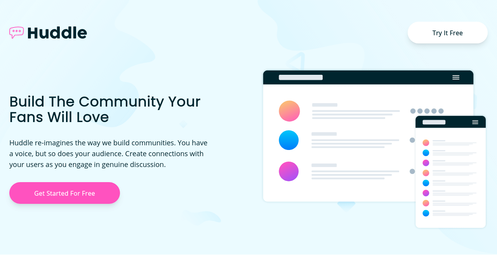
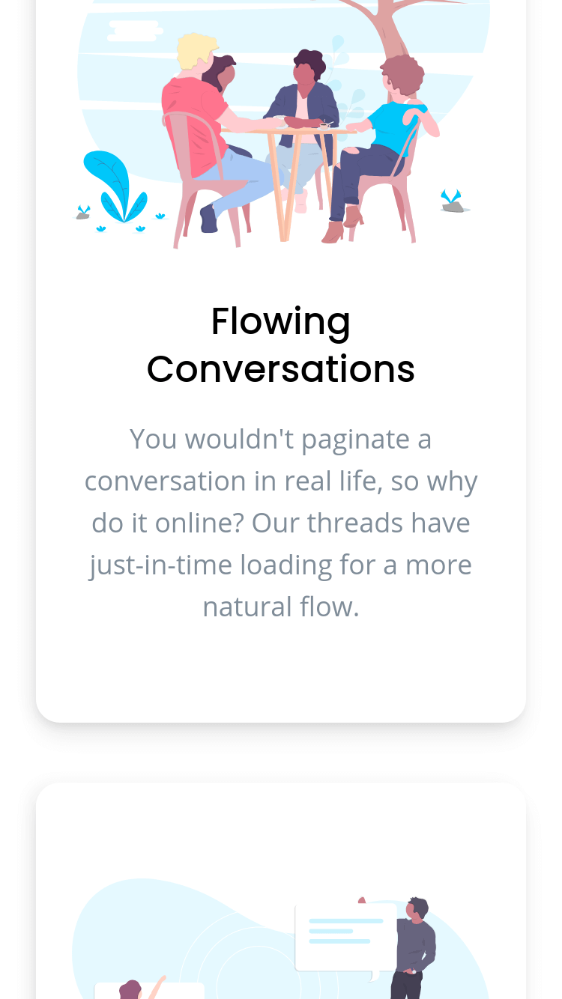

# Huddle - Demo Landing Page

This is a demo landing page for a fictional software company, Huddle.

  
Table of Contents

  <ol>
    <li><a href="#description">Description</a></li>
    <li><a href="#live-demo">Live Demo</a></li>
    <li><a href="#built-with">Built With</a></li>
    <li><a href="#author">Author</a></li>
    <li><a href="#license">License</a></li>
    <li><a href="#acknowledgements">Acknowledgments</a></li>
  </ol>

## Description

I built this project as part of FrontEnd Mentor's front-end challenges. The site is a demo landing page for a fictitious web analytics company, Shortly.

 

The site features a fully mobile responsive design.

  

 

## Live Demo

Preview the live demo: [https://jonrutter-huddle-landing-page.netlify.app/](https://jonrutter-huddle-landing-page.netlify.app/)

## Built with

- [Gatsby](https://www.gatsbyjs.com/)
- [TailwindCSS](https://tailwindcss.com/)

## Author

**Jon Rutter**

- [GitHub Profile](https://www.github.com/jonrutter)
- [Email](mailto:contact@jonrutter.com)
- [Website](https://www.jonrutter.com)

## License

This project is licensed under the MIT License. See the LICENSE file for details.

## Acknowledgements

- Credit to [FrontEnd Mentor](https://www.frontendmentor.io/) for creating the [site's design](https://www.frontendmentor.io/challenges/huddle-landing-page-with-alternating-feature-blocks-5ca5f5981e82137ec91a5100) and making it available as a free front-end challenge.
